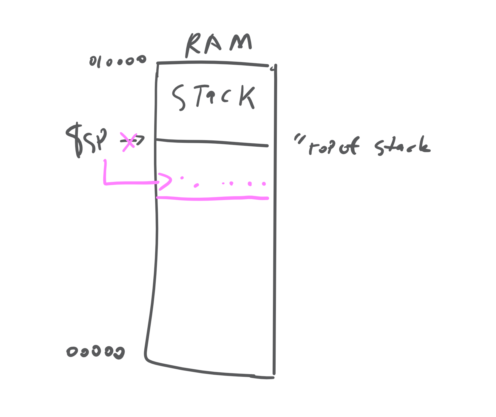

# 2019 02 24

Note: class topics are important because the textbook has incomplete information on this subject.

### Functions in MIPS

(@example25) Example: Implement the following `c` code in MIPS

```c++
main() {
  d = foo(2*a, b);
}

int foo(int x, int y) {
  return (x+y);
}

```

```MIPS
#allocate a -> $s0, b -> $s1, d -> $s2

      add  $a0, $s0, $s0    #a0 <- 2a (argument 0 register)
      add  $a1, $s1, $zero  #a1 <- b (" ")
      jal  foo              # call foo (see note)
      add  $s2, $v0, $zero  # d <- Return Value (2a,b)
      ...
foo:  add  $v0, $a0, $a1    # v0 <- x+y
      jr   $ra              # return


      # jal sticks result of next function into $ra
      # jr is transferring control to main
```
Note: we should not be writing foo at this point, this is a top down approach.

### Issues

1. What if main and foo use same registers?

   > Have a caller and &callee follow a convention to save registers somewhere special.


  | register | contents                |  Saved by |
  |----------|-------------------------|-----------|
  | 0        | `$zero`                 |           |
  | 1        |`$at` assembler temp     |           |
  | 2, 3     | return vale             |caller     |
  | 4,7      | `$a0-3`, arg regs       |caller     |
  | 8..15    | `$t0-8`, temp regs      | caller    |
  | 16.. 23  | `$s0-7`, s-registers    | callee    |
  | 24, 25   | `$t3`, `$t9` temp reg   | caller    |
  | 26, 27   | `$k0`, `$k1` resvd os   |           |
  | 28       | `$gp` global ptr        |callee     |
  | 29       | `$sp` stack pointr      | implicitly preserved  |
  | 30       | `$fp` frame pointr      | callee    |
  | 31       | `$ra` return address    | callee    |

  Table: MIPS Conventions


2. What if foo calls bar (or is recursive)?
   > Last in First out
   > Stacked function calls

  

   Use a stack to store different values of `$ra`.

   ```MIPS
  # push s1 onto stack:
      addi $sp, $sp, -4 # because stack grows downward
      sw $s1, 0($sp)
  # pop s5 off the stack:
      lw $s5, 0($sp)
      add $sp, $sp, 4
   ```

3. What if $> 4$ arguments?
   >same as 4

4. Where do functions store local vars that don't fit in registers?
   >store extra args & local [non-static!!!] that don't fit in regs in an "activation record" (also called a "procedure frame"). place frame on the stack, with $fp pointing to it.
   >access local vars as offsets to $fp


Frame

      | caller -saved regs      |
      | Extra args              |
      | saved $ra               |   <--- $fp
      | saved $fp               |
      | other callee saved-regs |
      | Local Vars              |
      | ------------------      |  < --- $sp
      |                         |

     For more information, observe the procedure in `procedure.pdf` supplied (and copyrighted) by Shankar.
