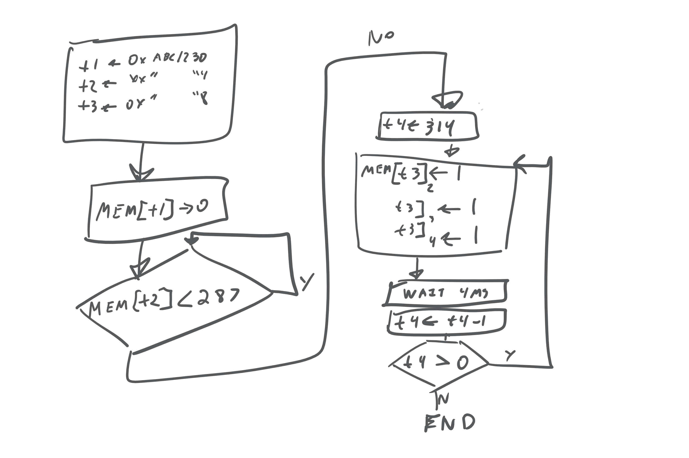
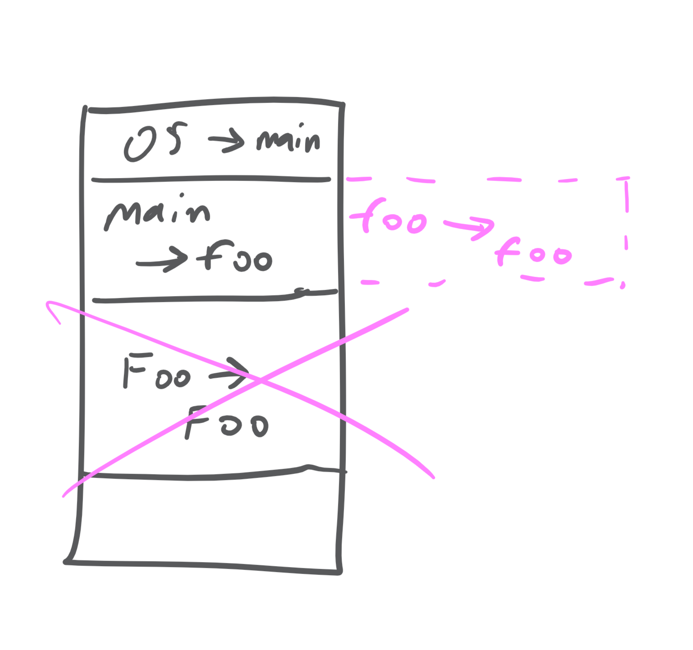
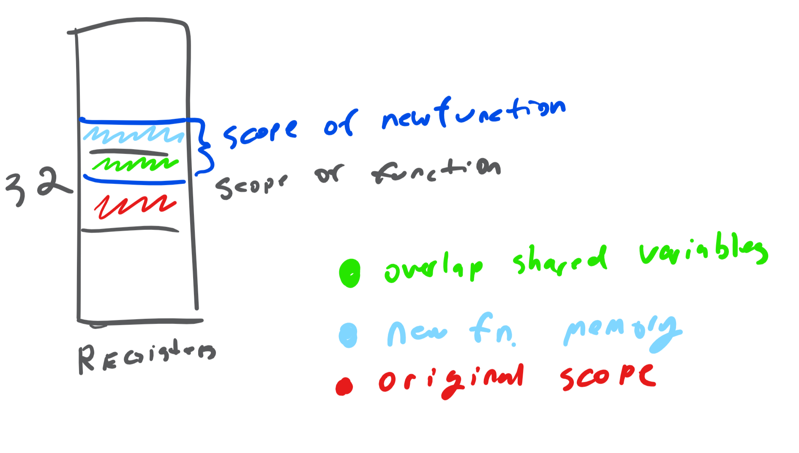

languages# 2019 03 06

Review of Week -2's HW 2-MachineCode-CFG



```{.mips .numberLines}
#$t1 <- 0xabcd1230
#$t2 <- 0xabcd1234
#$t3 <- 0xabcd1238

# addresses in memory t1-3
addi $t1, $zero, 0xABCD
sll  $t1, $t1, 16
ori $t1, $t1, 0x1230
addi $t2, $t1, 4
addi $t3, $t1, 8

sw   $zero, 0($t1)           # Step 2

loop   lw   $t5, 0($t2)             #t5 <- mem[t2]
slti $t6, $t5, 287
bne  $t6, $zero, Loop #wait

#skipping part 4
#...

#part 5 (bit 2)
loop2 lw  $t7, 0($t3)    #t7 <-MeM[t3]  || not strictly necessary
ori $t7, $t7, 4    #t7b2 <-1
sw  $t7, 0($t3)    #store t7
#... same for bit 2-3

#part 6
wait 4

#step 7
addi $t4, $t4 -1
bne  $t4, $zero, loop2
end
```

## Inlining

Compiler trick vs hardware implementation

Compiler optimization

# Tail Recursion Optimization (TRO)



There's no need to make a new frame because theres is nothing done after the inside call of foo. Let `foo(...)` be ... `return foo(...)`. In this case, replace frame instead of creating a new frame.

I started out for *tail recursion*, but as a method of optimization, it can be applied more generally.

### Issues

- TRO can't be done if callee has side effects

    - It semantic issues if callee accesses caller vars using pointers
    - these side effects are enforced against in some languages

### Hardware based approach

Register Windows (original RISC (Berkley)), SPARC, AMD29000, Intel i960)

problem

: popping, pushing continually is a intensive

solution?

~ make extra registers, but space is still wasted. This creates a new problem: instructions would be too large.

~ restrict the number of registers that functions can access.
Suppose num of registers is set to 32
When a function call is made, you access a different 32 registers, ex: accessing $0 will access a different $0.



  We can place arguments into the overlapping window areas, so we don't have to place them into stack, but rather shift the window in such a way that it contains the arguments required.
  Didn't want to spend extra transistors on this at the time, rather use them for other slower components.

Goal: Avoid memory overhead for saving / restoring registers on stack, without increasing instruction size. Hence, register windows were an idea.

## Characters & Strings

### c Datatypes

| type            |   size   |
|-----------------|----------|
| int (typically) | 32 bits  |
| longs           | 64 bits  |
| short           | 16       |
| char            |  8 bits  |

Methods for storing strings:

#. preceded by length (stl)
diagram done

#. null-terminated

Do not mix and match null-terminated and preceded by length STL strings.


storing chars:
___________________________________
|1 char per word |vs| 1 per byte|
Sometimes more efficient  vs. less storage

## New Instructions
lb Load byte
sb store byte   #same operands as sw, lw

(@2019-03-06) Example. Convert a null-terminated string from lower case to upper case.

```{.mips .numberLines}
#convert a null terminated string from lcase to ucase

loop:  lb $t2, 0($t0)      # $t2 <- next char
      beq $t2, $zero, exit # loop exit
     addi $t2, $t2, -32    # convert t2 to uc
       sb $t2, 0($t0)      # store new char
     addi $t0, $t0, 1      # point to next char (next char not word)
        j loop             # iterate
     beq $t2, $zero, Exit
```
